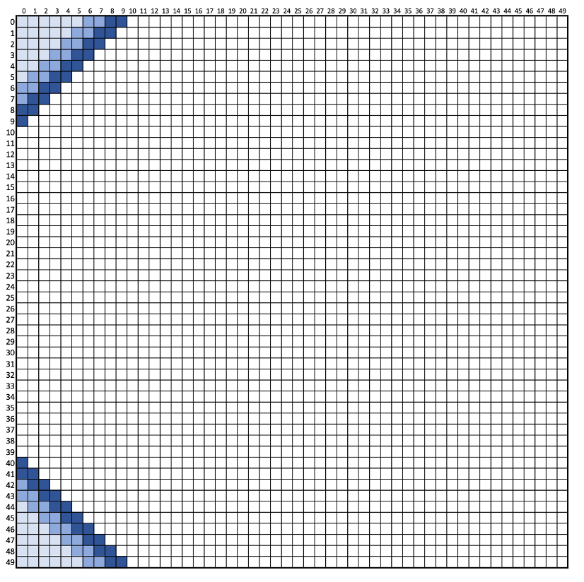
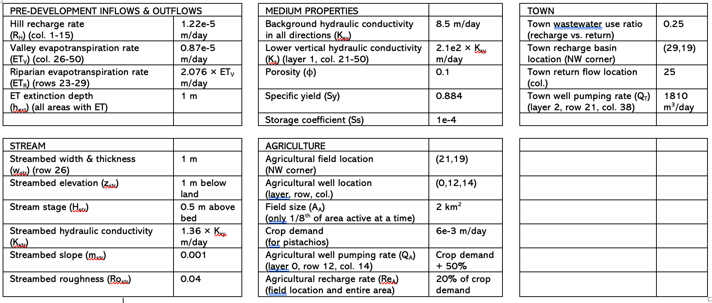

# The big challenge <!-- omit in toc -->

We have officially entered the last phase of this course. This week you are going to work on building a model for a domain that we will be using for the remainder of the course. A description of the domain is provided below along with details about parameters but no starter code. Its up to you to build the model!

## Table of Contents <!-- omit in toc -->
- [1. Problem Overview](#1-problem-overview)
- [2. Domain Details](#2-domain-details)
  - [2.1 Predevelopment](#21-predevelopment)
  - [2.2 Town Development](#22-town-development)
  - [2.3 Agricultural Development](#23-agricultural-development)
  - [2.4 Property Summary](#24-property-summary)
- [3.0 Your Assignment](#30-your-assignment)

## 1. Problem Overview
Our watershed is a modeling-friendly mountain catchment illustrated in *Figure 1*. The domain is bounded by no flow boundaries on three sides.  The downgradient boundary has been established as constant head based on the results of a larger-scale model.  There is a municipal well in the basin.  Some of the water used by the town is recharged after treatment, some is returned to the stream that runs through the basin.  Recharge is associated with the mountain block.  ET occurs in the basin floor and at a higher rate in the riparian area adjacent to the stream.  An agricultural business has proposed to add a well and irrigate crops on a new field.  In the comming weeks you will use the model to determine the risks of this in terms of agrochemicals reaching the stream, reduced streamflow, and additional drawdown in the town well.  The scenarios will be run as three steady state conditions: No Town and No Ag (NTNA); Yes Town and No Ag (YTNA); and Yes Town and Yes Ag (YTYA).  Some model parameters are known, others are unknown.

Figure 1 is a conceptual diagram of the domain you will be modeling. 
 
*Figure 1: Conceptual model of the study domain*

## 2. Domain Details 
### 2.1 Predevelopment
*(NOTE: in the description below all column row references are in python coordinates [row,col]. Refer to Figure 1 to see the plan view orientation of the rows and columns.)* 

You should build a steady state model.  The model should have 50x50 cells, each 1000 m in x and in y.  The porosity is 0.10, specific yield is 0.10, and storage coefficient is 0.0001.  There are three layers.  The medium is homogeneous within each layer.  The K of the top and bottom layers is 10 m/day in all three principal directions.  K of the middle layer is the same as the lower layer in the leftmost 20 columns, but it is 0.0001 m/day in the z direction in the remaining columns. 

The bottom of the domain is topographically flat and the bottom layer is 40 m thick.  The middle layer is 5 m thick and is also flat.  The top layer elevation is provided in `BASE_TOP_ELEV.CSV`.   

The top left and bottom left corners (in plan view) of the domain are 'rounded' by bedrock, as illustrated below in *Figure 2*.  Specifically, in the top left, there is a triangle of no flow cells extending from [0,0] to [5,5], inclusive, comprising a total of 21 no flow cells.  The middle layer has a similar triangular region extending from [0,0] to [7,7].  In the bottom layer it extends from [0,0] to [9,9].  (Hint: recall that to make cells inactive you can change them to 0 in the ibound array)

 
*Figure 2: Map of noflow bedrock cells. Lightest blue are no-flow in all three layers. Middle blue are no flow in the middle and bottom layers only and dark blue are low flow in the bottom layer only.*

The right boundary in all of the layers has a constant head of 70 m relative to the datum, which is located at the bottom of the domain. All other boundaries are no flow. 

Recharge occurs at a rate of 4E-5 m/day in the leftmost 15 columns and is zero elsewhere.  

A stream extends from the left to the right boundary in row 25.  The stream width, length, and thickness are 1.  No flow is entering the stream (from tributaries).  The K of the streambed is 1000 m/day.  The roughness is 0.04 and the slope is 0.001.  The streambed elevation is one m below ground surface and the stage is 0.5 m.    

ET is zero in the left half of the domain.  ET is 1E-5 m/day in the right half of the domain.  ET occurs at a rate of 5E-4 m/day in a riparian area that extends from the left boundary to the right boundary and occupies rows 22 to 28, inclusive.  The extinction depth is 1 m everywhere.

### 2.2 Town Development 
There is a well that is used for water supply by the local community, which is screened in the bottom layer at row 21 and column 38.  It is pumped at a rate of 1500 m3/day.  The town returns some treated water to the stream at column 25.

### 2.3 Agricultural Development
A field is proposed to cover a 2000 m by 2000 m area; 1/8th of the area will be irrigated agriculture at any time.  (Model this as uniform irrigation in time at 1/8th of the rate.)  The rectangular irrigated fields extend between rows 21 and 22 (inclusive) and columns 19 and 20 (inclusive).  

ET for the crop is zero - it is accounted for in the calculated recharge beneath the field. The recharge rate is assumed to be 20% of the water demand of the crop, representing intentional excess irrigation to avoid soil salinization.  The water uses of wheat, pistachios, and cotton on a daily basis are: 0.004; 0.006; and 0.008 m/day.  This leads to recharge rates of (e.g. 0.004 * 0.125 * 0.2 = 0.0001): 0.0001, 0.00015, and 0.0002 m/day for these crops, respectively.

Water is provided for irrigation from a well that is completed in the top layer at row 12 and column 14.  The pumping rate is equal to the crop water demand plus 20% for excess irrigation plus 30% for irrigation inefficiency.  For wheat, pistachios, and cotton, the pumping rates are (e.g. 0.004 *0.125 * 1.5 * 2000 * 2000 = 3000 m3/day): 3000; 4500; and 6000 m3/day. 

### 2.4 Property Summary
 

## 3.0 Your Assignment 
1. Build the base model as described above without the proposed agricultural activity.  Run the model as steady state with no pumping from the town's well.  This is your pre-development model.  It is referred to as No Town, No Ag (NTNA).
   
2. Build the base model as described above with the town well pumping.  This is referred to as Yes Town, No Ag (YTNA).

3. Add the proposed agricultural element (pumping and localized recharge).  This will be called YTYA, Yes Town, Yes Ag.

**What to submit:** 
This will be your second and final graded script for the semester. Your script is due **next Tuesday by the start of class**

Submit a jupyter notebook to Github that has your setup for all three scenarios alsong with any graphs that you would like to present that illustrate the behavior. 

- Make sure to include enough markdown cells to explain what you are doing and to provide a discusion of *every* graph you provide. 
- Ideally you can run all three scenarios in one notebook but if needed you can submit three. 

