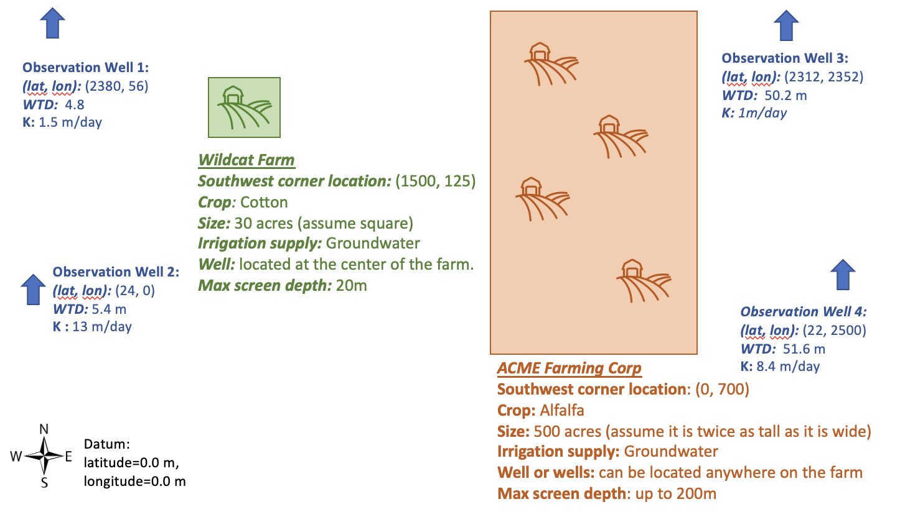

# Farm Challenge <!-- omit in toc -->

This week is going to be a little different. You are going to be putting together everything you have learned so far to build a model of a real world scenario.  I won't be giving you a starter code but dont' worry the starter codes from all of our FloPy assignments have everything you will need to complete this challenge. 

## Table of Contents <!-- omit in toc -->
- [What to submit when and how you will be graded](#what-to-submit-when-and-how-you-will-be-graded)
  - [Discussion lead instructions](#discussion-lead-instructions)
  - [Grading](#grading)
- [Domain description and assumptions](#domain-description-and-assumptions)
  - [Modelling Guidelines](#modelling-guidelines)
  - [Assumptions you should make](#assumptions-you-should-make)
- [The Challenge](#the-challenge)
- [Glossary questions](#glossary-questions)
   

## What to submit when and how you will be graded
This is the first graded model that you will be submitting. Because of this we **won't** be releasing the correct figures on Tuesday. 
- *Tuesday March 15th:* You should have your first draft of your model ready and your conceptual figure of how you setup your model. This will be graded for completion only. Submit: 
  1.  Your figure as a pdf to D2L
  2.  Your python notebook to your submission folder on GitHub.  
    
- *Thursday March 17th:* You will submit you final model and report that will be graded for quality. Submit: 
  1. Your report including all figures and discussion and glossary questions as a single pdf to D2L
  2. Your final python notebook to your submission folder on GitHub 

### Discussion lead instructions
Good news you do not have to submit figures early this week because we won't be releasing the correct figures to the class. However, you will each need to submit your own python notebook and report for grading this week, you will not be getitng a free pass on the individual assignment since it is graded. Your job as a discussion lead team is to coordinate with each other so that each person comes up with a different reasonable representations of the system (e.g. making different decisions about boundary conditions, subsurface properties, grid resolution etc). For your presentation/discussion on Thursday you will present all of your results comparing and contrasting how your different approaches changed your conclusions. 

### Grading  
- Tuesday's submissions will just be graded for completion the same as your normal Tuesday submissions.
- Your Thursday submission is your first graded model. Your Jupyter notebook will be worth 10 points and your report will be worth 10 points. 

*What you need for full credit on you notebook:*
  - I should be able run your notebook and generate your plots 
  - Complete and clear commenting throughout the notebook in markdown cells that explains what is what

*What you need for full credit on your report:* 
   - A clear description of your model domain and all the assumptions you made
   - A conceptual model figure which illustrates your model
   - A well thought out answer to the challenges including whatever figures are needed to support your answer.
   - Every figure should have a caption and only figures that are discussed in the text should be included.

## Domain description and assumptions
Wildcat farm is a small farm growing 30 acres of cotton in Southern Arizona. It has a well located in the center of the farm that provides all of its irrigation water.  ACME Farming Corp. is a large corporate farm which is looking to expand its operations into Arizona where groundwater regulations are less strict. They have purchased 500 acres and are planning on drilling two wells to supply water for the Alfalfa they plan to grow. 

There are no additional pumping wells in the area currently, however there are four observation wells that provide information on water levels and hydrogeologic properties. 

The figure below shows the locations of the farms and the wells (note this figure is not drawn to scale).

  

### Modelling Guidelines 
- Your model should be steady state.
- You can decide the size and number of grid cells in the x and y direction but should only have one layer in z.
- You should not use any packages other than what we have already used in our previous assignments.

### Assumptions you should make 
- The consumptive water use for Cotton in Arizona is 41.2 inches/year
- The consumptive water use for Alfalfa in Arizona is 74.3 inches/year
- The net recharge in non-irrigated areas within this area is 1e-4 m/day

## The Challenge 
Your client is Wildcat Farm and they would like to know whether the pumping on ACME farm is going to make their well go dry. 

1. Provide a clear summary of the design of your model and the reasoning behind it. At a minimum this should include: 
   - A conceptual figure showing your model design (for example you can refer to the conceptual figure we drew for the box model in HW2)
   - Description of your grid resolution and why you chose it
   - Description of any model parameters you have chosen and why
   - Description of any pumping, recharge or ET rates you choose to apply and how you derived the values you put into the model. 
   - An explanation of your boundary conditions
   - List all assumptions you are making in your model
   - A description of the three scenarios you are presenting and how they differ from each other. 
  
2.  Present at least three scenarios to explore the possibile outcomes for Wildcat Farm. Its up to you vary your scenarios. Each should still be consistent with the problem statement but you can make different assuptions about your setup (e.g. where ACME puts its wells, hydraulic conducitivity values, different boundary conditions). Try to come up with one scenario which is your best guess, one scenario where the Wildcat Farm well goes dry and one scenario where it doesnt. Provide any graphs and calculations needed to present and explore your scenario results to the client.  
       - Discuss what you think the most likely outcome is and why. 
       - Provide advice to Wildcat Farm on what conditions are needed for  their well not going dry? 

## Glossary questions
1. What does it mean to be simulating saturated flow vs variably saturated flow? What are the advantages and disadvantages of each? Why is it much harder to solve for unsaturated flow?  Integrate the concept of a linear versus a nonlinear model into your answer.
   
2. What is meant by an internal source/sink for ground water flow and how is it different than a boundary condition?  Give an example.
   
3. What is meant by ‘forecast uncertainty’ in the context of a groundwater model?  What are the sources of this uncertainty?   What is required for a prediction to be as robust as possible?

