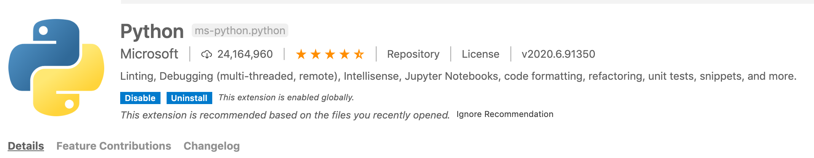
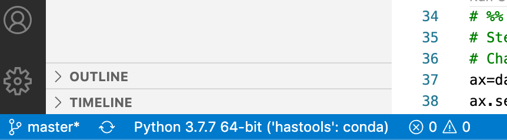
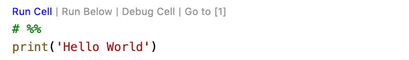
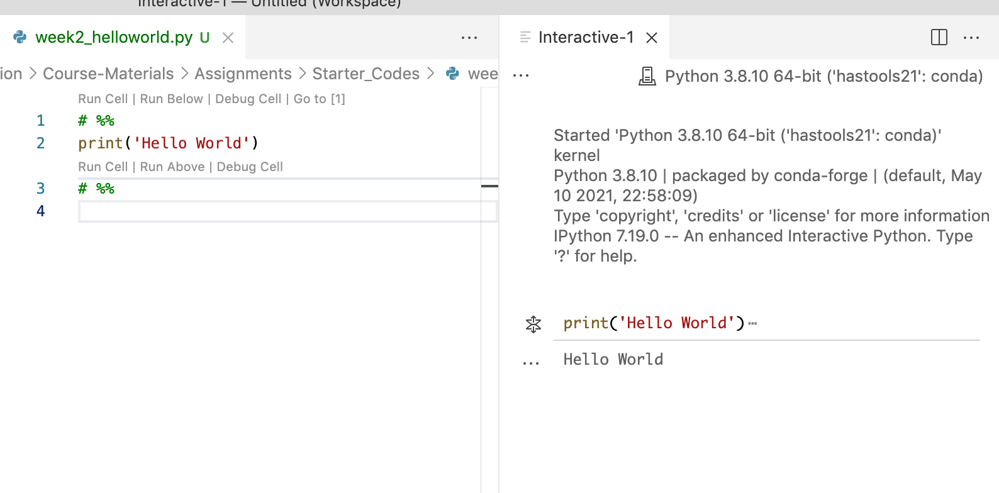

# Software Setup Instructions for Groundwater Modeling Spring 2022<!-- omit in toc -->

This semester we will be working with the following software programs. Everyone will need to have these programs setup on whatever computer(s) you are planning on using for the course.  Follow the setup instructions below to get everything installed.

- Github: This is where  course materials will be stored and where you will access your homework assignments.
- Gitkraken: This is a tool to help you manage local clones of GitHub repos.
- Python 3: We will be running MODFLOW models using Python with a package called FloPY
- VsCode: A tool for editing and running Python Scripts
- MODFLOW: the groundwater model we will be using.
____
# Table of contents <!-- omit in toc -->
- [Setup Part 1: All things Git](#setup-part-1-all-things-git)
  - [1. Setup account and install Github](#1-setup-account-and-install-github)
  - [2.	Install **GitKraken** and link to your GitHub account](#2install-gitkraken-and-link-to-your-github-account)
  - [3. Clone the course materials repo to your computer](#3-clone-the-course-materials-repo-to-your-computer)
  - [4.  Get your homework repo through GitHub Classroom](#4--get-your-homework-repo-through-github-classroom)
- [Setup Part 2: Python, miniconda and VSCode](#setup-part-2-python-miniconda-and-vscode)
  - [1. Install Miniconda](#1-install-miniconda)
  - [2. Make an environment for this class and activate it](#2-make-an-environment-for-this-class-and-activate-it)
  - [3.	Install Packages](#3install-packages)
- [Install Part 3: VS code](#install-part-3-vs-code)
  - [1. Download and install VS code](#1-download-and-install-vs-code)
  - [2. Setup VS code:](#2-setup-vs-code)
- [Install Part 4: MODFLOW](#install-part-4-modflow)
  - [Software Install Debugging tips](#software-install-debugging-tips)
  - [Mac Flopy install:](#mac-flopy-install)
- [Helpful Links and Tutorials for other tools](#helpful-links-and-tutorials-for-other-tools)


____
## Setup Part 1: All things Git

### 1. Setup account and install Github
  - Register for account on GitHub: <https://github.com/>
  - Check if you have GitHub installed and if not install it.  Directions for both Windows & Mac [here](http://happygitwithr.com/install-git.html). Windows users should follow Option 1 in 6.2. Mac users can follow Option 1 in 6.3.
  - *Note:* If you are a Windows user make sure you also install [GitBash](https://www.atlassian.com/git/tutorials/git-bash) as is noted in the instructions.
  - Setup options in Git. If you have a Mac, you can go to the terminal (Applications -> Utilities -> Terminal) as shown above. If you have a Windows, open Git BASH, which you should have downloaded.  You will need to  setup you [username](https://help.github.com/en/github/using-git/setting-your-username-in-git) and your [email](https://help.github.com/en/github/setting-up-and-managing-your-github-user-account/setting-your-commit-email-address)
  - *Optional: If you want to work with github through terminal you will need to generate a SSH key. This is not not necessary for class we will be using GitKraken which you will setup below so feel free to skip this step if you want. Instructions for this can be found [here](https://help.github.com/en/github/authenticating-to-github/adding-a-new-ssh-key-to-your-github-account).*


### 2.	Install **GitKraken** and link to your GitHub account
  1. This is a handy GUI for working with Git Repos. You can get it on the GitKraken website (www.gitkraken.com/). No need to worry about boards or timelines for now you can just install the free GUI.
  3. After you have installed GitKraken follow the instructions [here](https://support.gitkraken.com/integrations/github/) to link to your GitHub account. **Note:** you can stop at the 'Oauth step' but make sure you do the **Generate SSH** step.
1. 
   - *Optional: We will be using the free version of GitKraken for this class. However if you like this software and want to use it for private repos in the future you can also get a free upgrade to Git Kraken pro as a student if you go [here](https://education.github.com/pack?utm_source=github+gitkraken). This will let you work with private as  well as public repos using Git Kraken.*


### 3. Clone the course materials repo to your computer
**[This video provides a breif overview of the next steps on repo cloning](https://arizona.hosted.panopto.com/Panopto/Pages/Viewer.aspx?id=b1e63525-1dc7-43d4-b697-ae20016d557e)**

- Before you clone I recommend you start by creating a directory for this class where you will keep all of your repos. **NOTE:** It is best to create this directory as a local directory on your computer don't put it on OneDrive if you are using that.  I recommend you name this directory `GW_Modelling`
- *GitKraken Approach*
  1. In *GitKraken* got to `File/Clone Repo`
  1. Use the `Browse` button to navigate to the directory you created for the class that you want your repo cloned to.
  1. To get the `URL` open a web browser and go to the [GitHub organization](https://github.com/GW-modelling-Spring2022) for this course, click on the `Course-Materials22 Repo` and click on the green `code` button **make sure `ssh` is underlined** as the method to be used.
  1. When you do this you should see a url for the repo with a clipboard symbol next to it. Click on the clipboard to copy the URL.
  1. Paste this into the `URL` field in *GitKraken*

- *Command Line Approach*
    1. **NOTE:** The *GitKraken* approach is a little easier but it is good to know that you can do this multiple ways. So you might want to create a different directory and practice cloning this again.
    1. Make a directory for this class wherever you would like to have it on your computer
    1. Open a terminal window and navigate to your course directory (you can do this using the commands cd and pwd)
    1. Clone the main course materials repo: `git clone [ADD SSH]`
    1. *if your ssh keys aren't setup you can also clone it like this* `git clone [ADD LINK]`

### 4.  Get your homework repo through GitHub Classroom
1. Click on the following link to create your personal homework repo: <https://classroom.github.com/a/ZRj14bTV>

2. Make a local clone of your homework repo the same way you did with the course repo. You can refer back to the GitKraken approach instructions from **Step 3** just make make sure that you use the URL for your course homework repo this time and not the main course materials repo again.
      *Note:* If you received an error in the above steps, you may have to clone with HTTPS instead of SSH. You can do this by again clicking on the "Clone or Download" button in the repository page, then clicking "Use HTTPS" in the top right of the pop-up box. Now copy the link and repeat this step.

___
## Setup Part 2: Python, miniconda and VSCode
### 1. Install Miniconda
1.  Download and install the correct version of mini conda for your operating system. You can find all the options [here](https://docs.conda.io/en/latest/miniconda.html). Make sure you **pick the Python3.x not Python2.x version** for your system. Follow the prompts to install. The default options should be fine.
1.  Once you have done this you should be able to check you have it installed by typing `conda info` from command line. If it worked you should see all the info for what you just installed.
- If you get a message saying "command not found" when you type `conda info` then you will need to do the following additional steps:
  - open a new git bash window and type `vi .bash_profile`
  - You have now opened a file called ".bash_profile" in the program *vi*. To start editing this file type `i` you will see at the bottom of the screen that it is in insert mode now'
  - now type the following line into your file replacing the 'username' with whatever your user name is on your computer:
  ```
  export PATH="/c/Users/username/miniconda3/Scripts:$PATH"
  ```
  - Once you have typed this line hit the **escape** button to exit insert mode
  - Now hold down the **shift** key and type `zz` to exit and save your changes
  - To be sure you did it right you can `vi .bash_profile` again and you should see the line you added there. To quit without saving type `:q!`
  - Now that we have updated our bash profile we need to source it. So from you terminal type: `source .bash_profile`
  - If this worked you should no longer get a "command not found error" when you type `conda info`
  - Assuming you passed the last test you need to do one more setup step by typing `conda init bash`
  - Finally, to get this last step to take effect you will need to **close your current git bash window and open an new one**.
  - Fingers crossed... this should do it. You can now proceed to step 2!


### 2. Make an environment for this class and activate it
**[This video provides a breif overview of the next steps on environment setup](https://arizona.hosted.panopto.com/Panopto/Pages/Viewer.aspx?id=e5464dfb-ff76-4051-9559-ae2001704f04)** <n>
Next we will create a python environment for this class. You can follow along directly with the commands I have outlined below. All commands should be run from command line (i.e. terminal for mac or GitBash for windows). For more details  you should also refer to this [Quick environment setup workflow](https://uoa-eresearch.github.io/eresearch-cookbook/recipe/2014/11/20/conda/) or this [moredetailed user-guide for managing environments](https://docs.conda.io/projects/conda/en/latest/user-guide/tasks/manage-environments.html).

1. Create an enviroment called `gwmod`
    ```
    conda create --name gwmod python=3.8
    conda activate gwmod
    ```

    If this was successful you should see 'gwmod' in your list of environments if you type
    ```
    conda env list
    ```

2. Activate your environment by typing
    ```
    conda activate gwmod
    ```
    You should now see the environment name 'gwmod' at the start of your command line promt and if you type `conda env list` again you will see that this is the active environment.

3. Finally we will configure our environment so that it defaults to installing packages using conda forge. Make sure you have activated the gwmod environment by typing `conda activate gwmod` before you run these lines

    ```
    conda config --add channels conda-forge
    conda config --set channel_priority strict
    ```

### 3.	Install Packages
After you have setup your environment you will need to add Python packages to it.

1. If you haven't already open a terminal window (terminal for mac or Command Prompt for windows).
    ```
    conda activate gwmod
    ```

2. Then you will need to install the following packages
    To install you should run the following command from your terminal window:
    ```
    conda install modulename
    ```
    Where *modulename* is the name of the module from the list below:
    - pip
    - jupyter
    - numpy
    - matplotlib
    - pandas
  
3. Next Flopy has to be installed with pip not conda so finally run the following:
    ```
    pip install flopy
    ```
4. To check if you have installed these modules you can use the command
    ```
    conda list
    ```
___
## Install Part 3: VS code
### 1. Download and install VS code
**[This video provides a breif overview of the next steps on VS code](https://arizona.hosted.panopto.com/Panopto/Pages/Viewer.aspx?id=a59ed8af-209c-42f3-aa62-ae2001773458)** <n>

The IDE we will be using this semester is Visual Studio Code, called VS Code for short. Let's get it downloaded.
- **Mac users:**
  - Use this [link](https://code.visualstudio.com/) or just google 'vs code'. Click on *Download for Mac Stable Build*
  - Go to your Downloads folder and click on *VSCode-darwin-stable.zip*. Click and drag the Visual Studio code.app application into your Applications folder.
  - Open the application and make sure you can see the 'Welcome' and 'Untitled' tabs.
    - *Note:*A dialogue box might pop up stating that it’s an application downloaded from the internet, asking if you want to open it. Click Open.

- **Windows users:**
  - Use this [link](https://code.visualstudio.com/) or google vs code. Click on *Download for Windows Stable Build*.
  - Open the download and click the 'I accept the agreement' button.Click 'Next' and then 'Next' (let your machine choose where to put it).
  - When the *Select Addtional Tasks* window pops up, check all of the boxes before hitting 'Next.'
  - Now, you should be able to hit 'Install' and 'Finish.'
  - Open the application.
  
### 2. Setup VS code: 
  1. Install extensions: There is a large marketplace of VSCode extensions and a million ways you can customize your environment. For now though we will just start with two extensions. To install and extension go to `view > extensions` on the dropdown menu or choose extensions from your panel on the left. Once there you can search for the extensions you want to install.
     - First search for 'python'. You want the main one that comes up. It looks like this: 
  
     - Click `install` to install
     - Next search for `Markdown All In One` and install it
     - Finally search for and istall `Jupyter` and install it  

  2. Use `Open Folder` to open your directory for this class that has all of your repos.  You should see a file list on the left where you can easily explore all of your files now. If it asks you if you trust the authors, say yes.

  3. Next we will set our python environment
     - Type `Command + Shift + P` (apple) or `Ctrl + Shift + P`(windows) to pull up the command pallet
     - Type `Python: Select Interpreter` into the command pallet dialog (NOTE: once you start typing it should give you a list to choose from so you don't have to type the whole thing)
     - Choose the `gwmod` conda environment you created earlier
     - If this is  done correctly you should see your python environment in the bottom left corner of your vs code window like this (Note in this picture the environment is `hastools`, in your case it will be `gwmod`):
    

  4. At this point you should  try running a python script.
     - From your folder list double click to open `hello_world.py`
     - Click on the `run_cell` button at the top of the script to run it
    
     - Note: when you try to run a script using Python Interactive in VSCode for the first time, you will be prompted in a dialog box to download IPyKernal say yes to this.
     - If the code runs correctly you should have an interactive window that opens up and looks something like this :
    

     - If you are unable to download IPyKernal see instructions below

  5. If you want to be able to automatically run lines without copying and pasting every time (which is very helpful!). Do the following:
     - In VSCode go to: `File  >  Preferences  >  Settings`
     - At the top, Search settings bar type: `send selection`
     - Check the check box called somethin `Jupyter: Send Selection To Interactive Window`
     - To test if it works just highlight the `Print('hello_world')` from the editor and hit `shift+enter` and it will should automatically in your interactive window.

   6.  Fix for issue installing IpyKernal (skip if step 4 worked for you)
     - If the terminal reports an error similar to the below (in addition to a bunch of other text) when you try to run:
        ```
            conda : The term 'conda' is not recognized as the name of a cmdlet, function, script file, .....
        ```
  - The problem is that the default terminal in VSCode (for windows) is power shell. Power shell doesn't work well with VSCode.
  - The solution is to change the default terminal in VSCode to 'command prompt' using the following steps:
    - Hit ctrl+shift+p
    - Search for `Terminal: Select Default Profile`, and click
    - There should be a few available, including 'bash', `power shell`, and `command prompt`. Click on `command prompt`
    -  Exit and re-enter VSCode for the change to stick.

  - That's it! You should be able to download IPyKernal and run your script now.
     - To further check that 'command prompt' is your default terminal:
        1. Click in the toolbar `View > Terminal`
        2. At the top of the terminal, you should see a drop-down menu. Listed at the very top should be '1: cmd'.
        3. You can triple check by seeing `conda` and `python` work in the command line. For example, simply type in `conda`, and you'll get back a message starting with `conda is a tool for managing and deploying applications, environments and packages.`.
       - If something went wrong, you'll find a message such as: `bash: conda: command not found`. Try to start at step 1 again.
___
## Install Part 4: MODFLOW
**Mac Users:**
  Run the following commands to install MODFLOW using the PyMake
- Check if you have gfortran installed bu typing `which gfortran` or `gfortran -v` into command line. If you don't see that you have gfortran installed you should install it from [here](https://github.com/fxcoudert/gfortran-for-macOS/releases)

https://github.com/fxcoudert/gfortran-for-macOS/releases/tag/11-arm-alpha2 
- `cd` to a directory where you would like to put your MODFLOW builds
```
Pip install https://github.com/modflowpy/pymake/zipball/master
git clone https://github.com/modflowpy/pymake
cd pymake/examples
python make_mf2005.py
python make_mp7.py
```
- The mp7 and mf2005 folders created in this step have the mode executables that you will need to point to when you are running MODFLOW. If you want to move these somewhere else you can do so now.

**PC Users:**
  - Follow [these install instructions](https://water.usgs.gov/ogw/modflow-nwt/MODFLOW-NWT-Guide/index.html?beginners_guide_to_modflow.htm)
  - You can download MODFLOW 2005 [here](https://www.usgs.gov/software/modflow-2005-usgs-three-dimensional-finite-difference-ground-water-model).

  ____
  <a name="debug"></a>
  ### Software Install Debugging tips
  This is a running list of common issues and fixes if you run into issues please report them so we can add to this LIST

  ### Mac Flopy install:
  - If you get an error about missing .h files it could be that your headers are not installed. You can fix that following [these instructions](https://donatstudios.com/MojaveMissingHeaderFiles).
  - also check that you have a recent version of  gfortran installed and reinstall if  needed per the first step in the instruction

____
<a name="tutorials"></a>
## Helpful Links and Tutorials for other tools
- **Command Line** Note that as long as Windows users are using Git Bash the commands will be the same for them as Mac users. If Windows users use PowerShell instead some of the commands will be different.
  - [Unix Workbench - Command Line Basics (Mac Termina and Git Bash)](https://seankross.com/the-unix-workbench/command-line-basics.html#summary)
  - [Command Line Crash Course (Windows and Mac)](https://learnpythonthehardway.org/book/appendixa.html)
  - [Mac, WindowsComparison](https://arian-celina.com/windows-cmd-macos-terminal-navigation/#:~:text=The%20CMD%2FTerminal%20window&text=Home%20folder%20is%20the%20usual,name%20of%20the%20current%20folder)

- **GitHub**
  - [Intro to GitHub Tutorial](https://product.hubspot.com/blog/git-andgithub-tutorial-for-beginners)
  - [Another GitHub Tutorial](https://towardsdatascience.com/gettingstarted-with-git-and-github-6fcd0f2d4ac6)
  - [Github training game](https://learngitbranching.js.org/)

- **Conda**
  - [Quick environment setup workflow](https://uoa-eresearch.github.io/eresearch-cookbook/recipe/2014/11/20/conda/)
  - [Detailed user-guide for managing environments](https://docs.conda.io/projects/conda/en/latest/user-guide/tasks/manage-environments.html)

- **VS code**
  - [Basics of coding in VS code](https://code.visualstudio.com/docs/editor/codebasics)
  - [Tips and tricks for working in VS code](https://code.visualstudio.com/docs/getstarted/tips-and-tricks)
  - [Working with GitHub in VS code](https://code.visualstudio.com/docs/editor/github)
  - [Using terminal in VS code](https://code.visualstudio.com/docs/editor/integrated-terminal)
  - [Python environments in VS code](https://code.visualstudio.com/docs/python/environments)

- **Jupyter**
    - [Jupyter Tutorial](https://www.dataquest.io/blog/jupyter-notebook-tutorial/)

- **Markdown**
  - [Markdown Cheatsheet](https://github.com/adam-p/markdown-here/wiki/Markdown-Cheatsheet)
  -[Another Longer Markdown Cheatsheet](https://github.com/adam-p/markdown-here/wiki/Markdown-Cheatsheet#emphasis)

